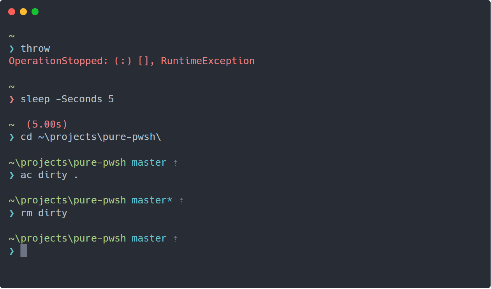

# pure-pwsh

> PowerShell implementation of the [pure prompt](https://github.com/sindresorhus/pure).



## Dependencies

- Terminal with ANSI colour support
  (e.g. any modern version of Windows 10, ConEmu, Hyper, ansicon, etc.)
- PSReadLine for async prompt updates and colour scheme integration
  (tested against 2.0, should mostly work on 1.x too)
- posh-git _and_ git executable on `$env:path` for git features

## Options

Set options on the `$pure` global.

| Option                | Description                                                 | Default value                                              |
| :-------------------- | :---------------------------------------------------------- | :--------------------------------------------------------- |
| **`PwdColor`**        | Colour of the current directory name.                       |  |
| **`BranchColor`**     | Colour of the current branch.                               |  |
| **`RemoteColor`**     | Colour used for remote status (up and down arrows).         |  |
| **`ErrorColor`**      | Colour used for the error prompt and long running commands. |  |
| **`PromptColor`**     | Colour used for the main prompt.                            |  |
| **`PromptChar`**      | Prompt character.                                           | `❯`                                                        |
| **`UpChar`**          | Up arrow.                                                   | `⇡`                                                        |
| **`DownChar`**        | Down arrow.                                                 | `⇣`                                                        |
| **`SlowCommandTime`** | Timespan beyond which a command is considered 'slow'.       | `00:00:05`                                                 |
| **`FetchInterval`**   | Interval to check remote for updates. (0 to disable.)       | `00:05:00`                                                 |
| **`Debounce`**        | Ignore successive updates within the given window.          | `00:00:00.5`                                               |

## Installation

Install from the [gallery](https://www.powershellgallery.com/packages/pure-pwsh) or clone this repository:

```shell
Install-Module pure-pwsh
```

and import it in your profile _after_ posh-git:

```shell
Import-Module pure-pwsh
```

# Not currently included

- Does not display username and host for remote sessions
- Does not set window title
- No vi mode indicator
