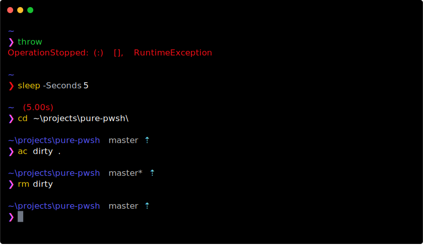

# pure-pwsh

> PowerShell implementation of the [pure prompt](https://github.com/sindresorhus/pure).



## Dependencies

- Terminal with ANSI colour support
  (e.g. any modern version of Windows 10, ConEmu, Hyper, ansicon, etc.)
- PSReadLine for async prompt updates. Works best with PSReadLine 2.0.

## Options

Set options on the `$pure` global.

| Option                | Description                               | Default value                                      |
| :-------------------- | :---------------------------------------- | :------------------------------------------------- |
| **`PwdColor`**        | Colour of the current directory name.     |  |
| **`BranchColor`**     | Colour of the current branch name.        |  |
| **`RemoteColor`**     | Colour of remote status (up/down arrows). |  |
| **`ErrorColor`**      | Colour of error prompt and slow commands. |  |
| **`PromptColor`**     | Colour of the main prompt.                |  |
| **`PromptChar`**      | Prompt character.                         | `❯` (or `→` on PSReadLine < 2.0)                   |
| **`UpChar`**          | Up arrow.                                 | `⇡` (or `↑` on PSReadLine < 2.0)                   |
| **`DownChar`**        | Down arrow.                               | `⇣` (or `↓` on PSReadLine < 2.0)                   |
| **`SlowCommandTime`** | Duration at which command is 'slow'.      | `00:05`                                            |
| **`FetchInterval`**   | Period at which to fetch from remotes.    | `05:00`                                            |
| **`BranchFormatter`** | Customize format of git branch name.      | `{$args}`                                          |
| **`PwdFormatter`**    | Customize format of working dir name.     | `{$args -replace [Regex]::Escape($HOME),'~'}`      |
| **`PrePrompt`**       | Customize the line above the prompt.      | `param ($cwd, $git, $slow) "$cwd $git $slow"`      |

To customize the formatting of the current git branch or working directory, provide a function that
transforms a string parameter into a string output. For example, this truncates the branch name by
underscore delimited segments:

```sh
$pure.BranchFormatter = {
     $args |% {
       @(((($_ -split '_' | select -First 3) -join '_') + '…'), $_)
     } | sort Length | select -First 1
}
```

## Installation

Install from the [gallery](https://www.powershellgallery.com/packages/pure-pwsh) or clone this repository:

```shell
Install-Module pure-pwsh
```

and import it in your profile. If you use this with `posh-git` (recommended for its excellent command completion)
then you'll probably want to import `pure-pwsh` first so that `posh-git` doesn't waste time configuring the prompt.

```shell
Import-Module pure-pwsh
```

## Compatibility

The packaged dependencies are built for the Windows x64 platform. To build for an alternative platform,
`cd` into the directory containing `PurePwsh.csproj` (i.e. `$env:PSModulePath/pure-pwsh/[version]/pure-pwsh`)
and run:

```shell
dotnet publish -o bin -c Release -r [your-runtime] # https://docs.microsoft.com/en-us/dotnet/core/rid-catalog
```

## Not currently included

- Does not display username and host for remote sessions
- Does not set window title
- No vi mode indicator

Consider [raising an issue](https://github.com/nickcox/pure-pwsh/issues/new) if you want any of the above.
